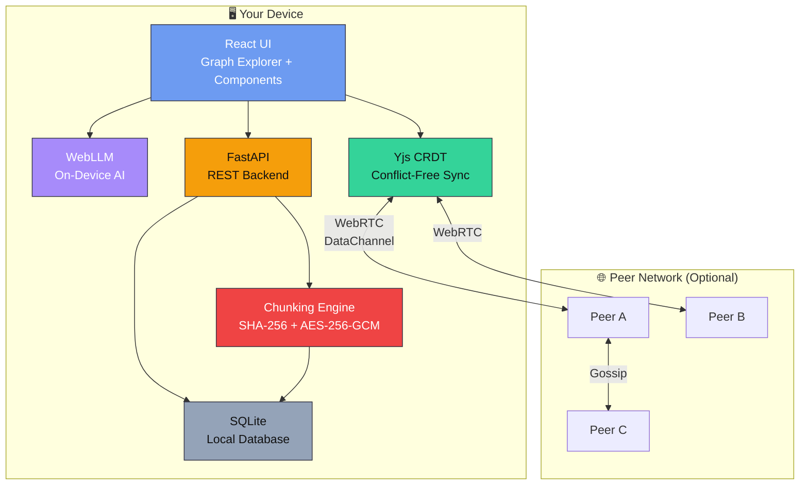
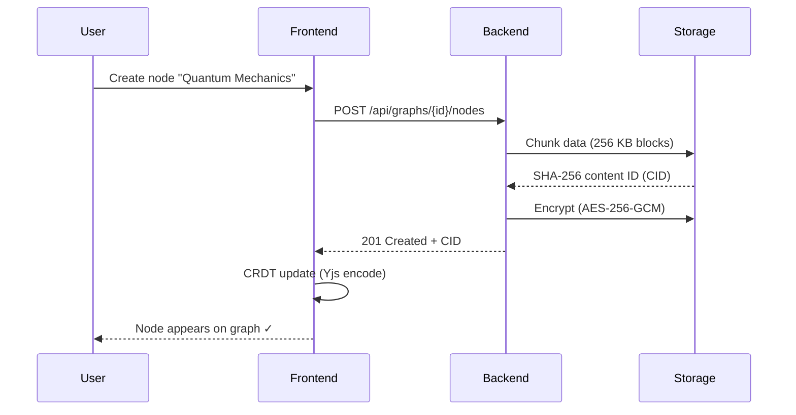
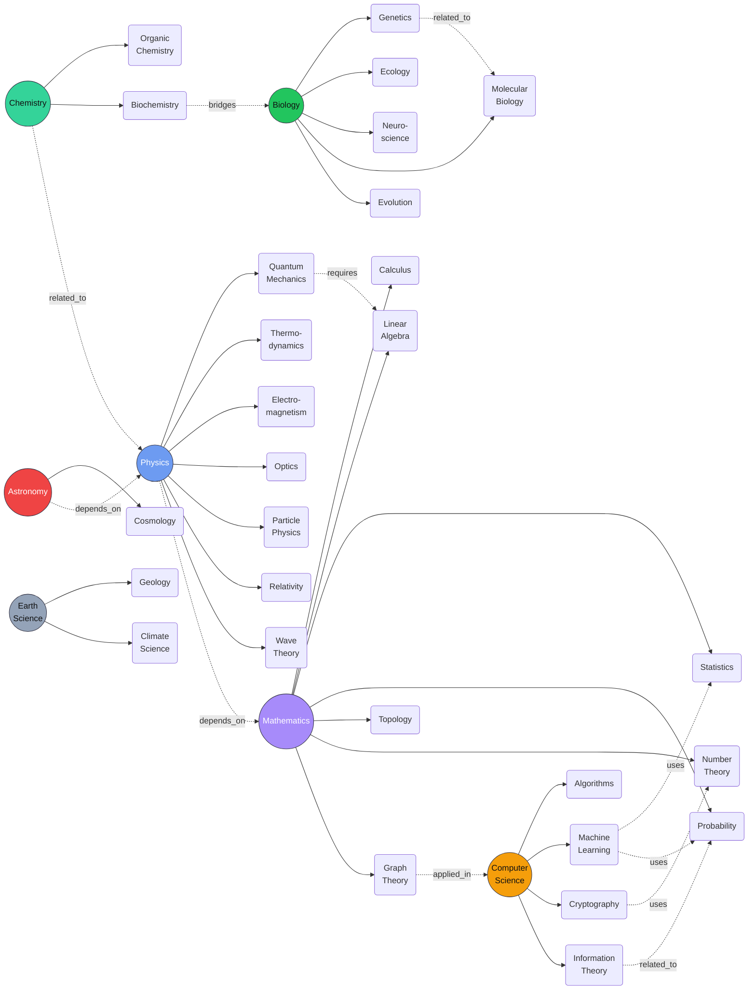
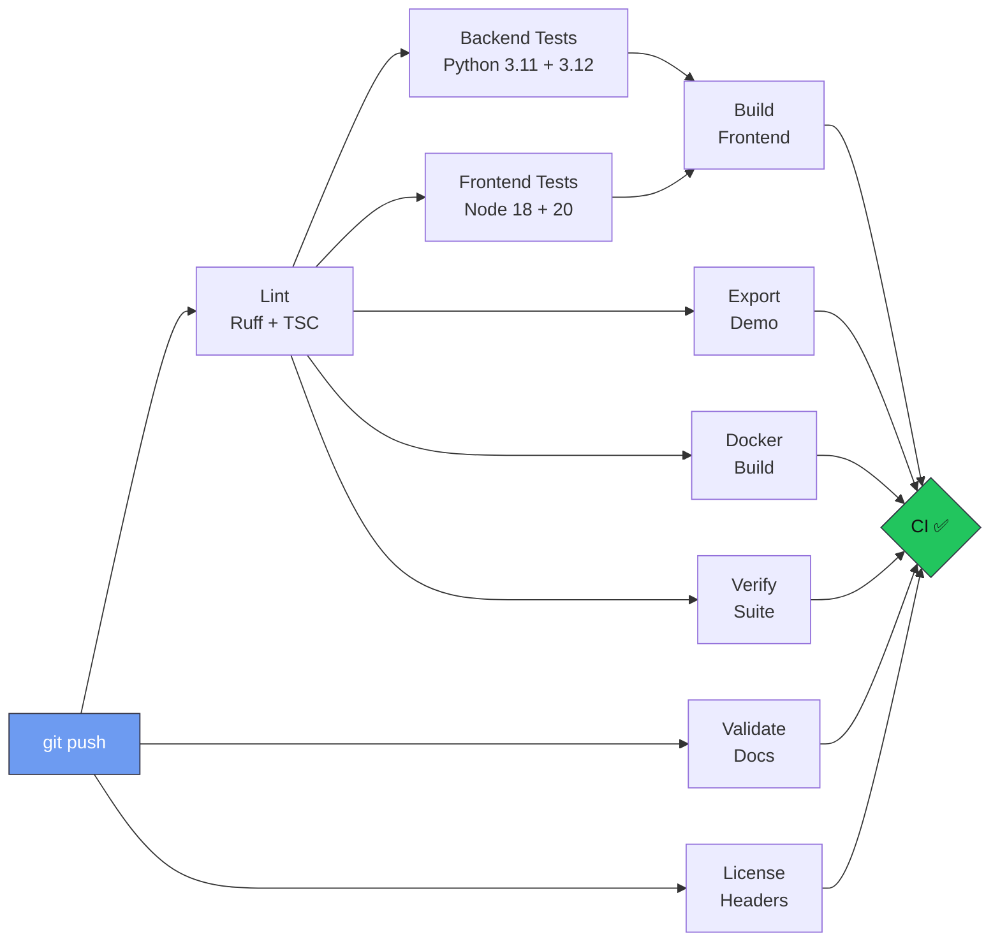

<!-- Project Mycelium — Nurturing Knowledge Without the Cloud -->
<!-- Copyright (c) 2026 Zorvia Community (https://github.com/Zorvia) -->
<!-- Licensed under the Zorvia Public License v2.0 (ZPL v2.0) -->

<div align="center">


<br />
<br />

```
  __  __                  _ _
 |  \/  |_   _  ___ ___| (_)_   _ _ __ ___
 | |\/| | | | |/ __/ _ \ | | | | | '_ ` _ \
 | |  | | |_| | (_|  __/ | | |_| | | | | | |
 |_|  |_|\__, |\___\___|_|_|\__,_|_| |_| |_|
         |___/
```

# Project Mycelium

### *Nurturing Knowledge Without the Cloud*

**A local-first, peer-to-peer knowledge graph with offline AI, CRDT sync,
encrypted content-addressed storage — and zero cloud dependency.**

[](https://github.com/Zorvia/project-mycelium/actions/workflows/ci.yml)
[](LICENSE.md)
[](https://python.org)
[](https://nodejs.org)
[](https://stav.org.au)

---

*Like the fungal networks that connect forests underground,<br>Project Mycelium links knowledge — privately, resiliently, and without a central server.*

</div>

---

## TL;DR

```bash
# Clone and run — one command
git clone https://github.com/Zorvia/project-mycelium.git
cd project-mycelium && npm run dev

#   Frontend  →  http://localhost:3000
#   Backend   →  http://localhost:8000
#   API docs  →  http://localhost:8000/docs
```

**No server? No problem.** Open `demo/mycelium_demo.html` in any browser — no install, no internet, no signup.

<details>
<summary><strong>Other ways to run</strong></summary>

```bash
# Docker (backend + frontend in one container)
docker build -t mycelium:demo .
docker run -p 8000:8000 mycelium:demo

# Export static demo
python scripts/export_demo.py            # → demo/mycelium_demo.html

# Seed database with demo data
python scripts/seed_demo_data.py

# Run tests
npm run test                              # Frontend (Vitest) + Backend (pytest)
```

</details>

---

## What Is Project Mycelium?

Most knowledge tools today require accounts, internet, and trust in a third-party cloud. Your notes, research, and connections live on someone else's server.

**Project Mycelium is different.** It's a knowledge graph application where:

| Principle | What It Means |
|-----------|---------------|
| **Local-first** | All data stays on *your* device in SQLite. You own it. |
| **Peer-to-peer** | Collaborate by connecting directly to peers via WebRTC — no server in between. |
| **Offline AI** | An on-device language model (WebLLM) explains concepts without sending data anywhere. |
| **Content-addressed** | Every piece of data gets a SHA-256 fingerprint. If the content changes, the address changes. |
| **Encrypted** | AES-256-GCM authenticated encryption for all shared data. |
| **Conflict-free** | CRDTs (Yjs) ensure that concurrent edits from multiple peers merge automatically — no conflicts, no data loss. |

> **For judges & teachers:** Think of it as a private Wikipedia where students can map out scientific concepts, see how they connect, collaborate with classmates offline, and ask an AI to explain things — all without ever touching the cloud.

---

## How It Works

### Architecture at a Glance



### Data Flow



### Network Topology: Mesh vs. Cloud

```
  ┌────┐         ┌────┐             ┌────────┐
  │ P1 │─────────│ P2 │             │ Server │
  └──┬─┘         └─┬──┘             └───┬────┘
     │    ╲    ╱    │               ╱    │    ╲
     │     ╲  ╱     │              ╱     │     ╲
     │      ╲╱      │           ┌────┐ ┌────┐ ┌────┐
     │      ╱╲      │           │ C1 │ │ C2 │ │ C3 │
     │     ╱  ╲     │           └────┘ └────┘ └────┘
  ┌──┴─┐         ┌─┴──┐
  │ P3 │─────────│ P4 │          ✗ Single point of failure
  └────┘         └────┘          ✗ Requires internet
                                 ✗ Data on corporate servers
  ✓ No single point of failure
  ✓ Works offline                  Project Mycelium uses
  ✓ Direct peer connections        the mesh on the left. →
  ✓ Your data stays yours
```

---

## The Demo Knowledge Graph

The built-in demo ships with a **real, explorable** science knowledge graph:

```
 35 nodes  ·  42 edges  ·  7 disciplines  ·  6 relationship types
```



<details>
<summary><strong>ASCII version (for terminals)</strong></summary>

```
                              ┌──────────────────────────────────────────────────────────┐
                              │           Project Mycelium — Science Knowledge Graph     │
                              │           35 nodes · 42 edges · 7 disciplines            │
                              └──────────────────────────────────────────────────────────┘

        MATHEMATICS                      PHYSICS                         CHEMISTRY
    ┌───────────────────┐          ┌──────────────────┐            ┌──────────────────┐
    │                   │          │                  │            │                  │
    │  ◉ Calculus       │          │  ◉ Quantum Mech. │            │  ◉ Organic Chem. │
    │  ◉ Linear Algebra │◄─requires─│  ◉ Thermo.      │            │  ◉ Biochemistry ─┼─bridges─┐
    │  ◉ Statistics ◄──uses── ML   │  ◉ Electromag.   │◄─related──│                  │         │
    │  ◉ Probability    │          │  ◉ Optics        │            └──────────────────┘         │
    │  ◉ Topology       │          │  ◉ Particle Phys.│                                        │
    │  ◉ Number Theory  │          │  ◉ Relativity    │                                        │
    │  ◉ Graph Theory ──┼─applied_in─►CS              │         BIOLOGY                        │
    └─────────┬─────────┘          │  ◉ Wave Theory   │    ┌──────────────────┐                 │
              │                    └────────┬─────────┘    │                  │◄────────────────┘
              │                depends_on   │              │  ◉ Genetics ──related── Mol. Bio   │
              └─────────────────────────────┘              │  ◉ Ecology              ◉         │
                                   ▲                       │  ◉ Neuroscience                    │
                                   │  depends_on           │  ◉ Evolution                       │
                              ┌────┴─────────┐             └──────────────────┘
        COMPUTER SCIENCE      │  ASTRONOMY   │
    ┌───────────────────┐     │              │         EARTH SCIENCE
    │                   │     │  ◉ Cosmology │    ┌──────────────────┐
    │  ◉ Algorithms     │     └──────────────┘    │                  │
    │  ◉ Machine Learn. │                         │  ◉ Geology       │
    │  ◉ Cryptography ──┼─uses─► Num. Theory      │  ◉ Climate Sci.  │
    │  ◉ Info. Theory ──┼─related─► Probability    └──────────────────┘
    └───────────────────┘
```

</details>

---

## Project Structure

```
project-mycelium/
│
├── src/
│   ├── backend/                    # Python FastAPI backend
│   │   └── mycelium/               #   Main package
│   │       ├── main.py             #     App entry point
│   │       ├── routes.py           #     API endpoints
│   │       ├── models.py           #     SQLAlchemy ORM models
│   │       ├── schemas.py          #     Pydantic v2 schemas
│   │       ├── services.py         #     Business logic (CRUD)
│   │       ├── database.py         #     Async engine & sessions
│   │       ├── chunking.py         #     SHA-256 + AES-256-GCM
│   │       └── config.py           #     Environment config
│   │
│   └── frontend/                   # React + TypeScript frontend
│       └── src/
│           ├── components/         #   UI component library
│           │   ├── Button.tsx      #     8 reusable components
│           │   ├── Icon.tsx        #     SVG icon system
│           │   ├── Modal.tsx       #     Dialog manager
│           │   ├── NodeCard.tsx    #     Graph node detail card
│           │   └── SearchBar.tsx   #     Fuzzy search interface
│           ├── graph/              #   D3.js force-directed graph
│           │   └── GraphCanvas.tsx #     Interactive canvas
│           ├── crdt/               #   Yjs CRDT documents
│           │   └── CRDTDocument.ts #     Conflict-free replication
│           ├── p2p/                #   WebRTC peer networking
│           │   └── P2PManager.ts   #     Mesh topology manager
│           ├── ai/                 #   On-device intelligence
│           │   └── LocalLLMAdapter.ts  # WebLLM integration
│           ├── App.tsx             #   Root application
│           ├── demoData.ts         #   35-node demo graph
│           └── types.ts            #   Shared type definitions
│
├── tests/
│   ├── backend/                    # pytest (5 test modules)
│   └── frontend/                   # Vitest (4 test suites)
│
├── scripts/
│   ├── export_demo.py              # Generate static HTML demo
│   ├── seed_demo_data.py           # Seed SQLite with demo data
│   └── verify_demo.sh              # Full verification suite
│
├── docs/                           # Extended documentation
│   ├── ARCHITECTURE.md             #   System design & diagrams
│   ├── DESIGN.md                   #   Design tokens & components
│   └── validate_docs.py            #   Doc presence validator
│
├── demo/                           # Static demo output
├── data/                           # Databases & datasets
├── deploy/                         # Netlify / Vercel configs
├── ci/                             # Legacy CI configs
├── .github/                        # GitHub Actions & templates
│   ├── workflows/
│   │   ├── ci.yml                  #   Full CI pipeline
│   │   └── deploy-static.yml      #   Deploy to Pages/Netlify/Vercel
│   ├── ISSUE_TEMPLATE/             #   Bug, feature, question
│   ├── PULL_REQUEST_TEMPLATE.md    #   PR checklist
│   └── FUNDING.yml                 #   Sponsorship links
│
├── Dockerfile                      # Multi-stage container build
├── docker-compose.yml              # One-command orchestration
├── package.json                    # Monorepo scripts
├── pyproject.toml                  # Python project metadata
├── requirements.txt                # Python dependencies
└── LICENSE.md                      # Zorvia Public License v2.0
```

---

## Documentation

Detailed guides and deep-dives are organized across focused documents:

| Document | What You'll Find |
|----------|------------------|
| **[ARCHITECTURE.md](docs/ARCHITECTURE.md)** | System layers, data model, sequence diagrams, technology decisions |
| **[DESIGN.md](docs/DESIGN.md)** | Dark/light tokens, typography, component specs, accessibility |
| **[DEPLOYMENT.md](DEPLOYMENT.md)** | Deploy to Netlify, Vercel, Cloudflare Pages, Render, Docker |
| **[PERFORMANCE.md](PERFORMANCE.md)** | Benchmarks, profiling, optimization strategies |
| **[SECURITY.md](SECURITY.md)** | Threat model, encryption details, vulnerability reporting |
| **[PRESENTER.md](PRESENTER.md)** | 60-second script, 5-slide deck outline, demo walkthrough |
| **[FAQ.md](FAQ.md)** | 40+ questions answered for judges, teachers, devs, and admins |
| **[CONTRIBUTING.md](CONTRIBUTING.md)** | How to contribute, code style, PR process |
| **[CODE_OF_CONDUCT.md](CODE_OF_CONDUCT.md)** | Community standards and enforcement |

> **Judges & teachers:** Start with [PRESENTER.md](PRESENTER.md) for a quick overview, then explore [FAQ.md](FAQ.md) for common questions.

---

## Tech Stack

```
┌─────────────────────────────────────────────────────────────────────┐
│  LAYER              TECHNOLOGY              PURPOSE                │
├─────────────────────────────────────────────────────────────────────┤
│                                                                     │
│  Presentation       React 18 + TypeScript    Interactive UI         │
│                     Vite                      Fast dev & builds     │
│                     D3.js                     Force-directed graphs │
│                     TailwindCSS               Utility styling       │
│                                                                     │
│  Intelligence       WebLLM (WebGPU)           On-device AI          │
│                     Stub Summarizer           Offline fallback      │
│                                                                     │
│  Synchronization    Yjs                       CRDTs (conflict-free) │
│                     WebRTC DataChannels       Peer-to-peer mesh     │
│                                                                     │
│  Storage            SQLite + aiosqlite        Local database        │
│                     SHA-256                   Content addressing    │
│                     AES-256-GCM               Authenticated encrypt │
│                                                                     │
│  API                FastAPI + SQLAlchemy       Async REST backend    │
│                     Pydantic v2               Validation & schemas  │
│                                                                     │
│  Testing            Vitest                    Frontend unit tests   │
│                     pytest + pytest-asyncio   Backend unit tests    │
│                     Playwright                End-to-end tests      │
│                                                                     │
│  DevOps             GitHub Actions            CI/CD pipelines       │
│                     Docker (multi-stage)      Containerized deploy  │
│                     Ruff                      Python lint & format  │
│                                                                     │
└─────────────────────────────────────────────────────────────────────┘
```

<details>
<summary><strong>Why these choices?</strong></summary>

| Decision | Choice | Reasoning |
|----------|--------|-----------|
| **CRDT** | Yjs | Best-in-class performance, wide adoption, sub-document support |
| **Transport** | WebRTC | Browser-native, NAT traversal, encrypted by default (DTLS) |
| **Storage** | SQLite | Zero-config, serverless, perfect for local-first |
| **Hashing** | SHA-256 | Industry standard, Web Crypto API support |
| **Encryption** | AES-256-GCM | Authenticated encryption with hardware acceleration |
| **Frontend** | React + TS | Ecosystem, type safety, component reuse |
| **Graph Viz** | D3.js | Most flexible force-directed layouts, SVG + Canvas |
| **Build** | Vite | Sub-second HMR, optimized production builds, ESM-native |
| **API** | FastAPI | Async-first, auto-generated docs, Pydantic validation |
| **AI** | WebLLM | Fully on-device inference via WebGPU — zero data leakage |

</details>

---

## Quick Start

### Prerequisites

| Tool | Version | Check |
|------|---------|-------|
| Node.js | >= 18 | `node --version` |
| Python | >= 3.11 | `python --version` |
| pip | latest | `pip --version` |

### Development Setup

```bash
# 1. Clone the repo
git clone https://github.com/Zorvia/project-mycelium.git
cd project-mycelium

# 2. Install frontend dependencies
cd src/frontend && npm ci && cd ../..

# 3. Set up Python environment
python -m venv .venv
source .venv/bin/activate        # Windows: .venv\Scripts\activate
pip install -r requirements.txt

# 4. Seed the database with demo data
python scripts/seed_demo_data.py

# 5. Start both servers
npm run dev
#   Frontend  →  http://localhost:3000
#   Backend   →  http://localhost:8000/docs
```

### Static Demo (No Install)

```bash
python scripts/export_demo.py
# Open demo/mycelium_demo.html in any browser — works completely offline
```

### Docker

```bash
docker build -t mycelium:demo .
docker run -p 8000:8000 mycelium:demo
# Visit http://localhost:8000
```

### Run Tests

```bash
# All tests
npm run test

# Backend only
cd src/backend && python -m pytest ../../tests/backend/ -v

# Frontend only
cd src/frontend && npx vitest run
```

### Verify Everything Works

```bash
bash scripts/verify_demo.sh
# Checks 80+ file existence, content, and structure assertions
```

---

## CI/CD

Every push triggers a comprehensive pipeline:



Deployment to GitHub Pages, Netlify, or Vercel happens automatically on merge to `main`. See [`.github/workflows/`](.github/workflows/) for full workflow definitions.

---

## Philosophy

```
┌─────────────────────────────────────────────────────────────────────┐
│                                                                     │
│   "Like mycelium beneath a forest, knowledge networks should be    │
│    decentralized, resilient, and grow organically — connecting      │
│    ideas underground where no single point of failure can           │
│    sever the web of understanding."                                │
│                                                                     │
└─────────────────────────────────────────────────────────────────────┘
```

Project Mycelium is built on three convictions:

1. **Your data is yours.** No cloud, no accounts, no tracking. Everything runs on your device.
2. **Knowledge should be free.** Open source under ZPL v2.0 — use it, modify it, share it.
3. **Privacy is a right, not a feature.** Encryption isn't optional; it's the default.

This project was created for the **Science Talent Search (STS) 2026** to demonstrate that powerful, collaborative, AI-enhanced tools can exist without sacrificing privacy or requiring corporate infrastructure.

---

## License

Licensed under the **[Zorvia Public License v2.0](LICENSE.md)** (ZPL v2.0).

```
Copyright (c) 2026 Zorvia Community (https://github.com/Zorvia)

Permission is granted to use, copy, modify, and distribute this
software under the terms of the Zorvia Public License v2.0.

THIS SOFTWARE IS PROVIDED "AS IS", WITHOUT WARRANTY OF ANY KIND.
See LICENSE.md for full text and disclaimers.
```

---

<div align="center">

```
        ◉───────◉───────◉
       ╱ ╲     ╱ ╲     ╱ ╲
      ◉   ◉───◉   ◉───◉   ◉
       ╲ ╱     ╲ ╱     ╲ ╱
        ◉───────◉───────◉
```

**Project Mycelium** — Nurturing Knowledge Without the Cloud

*Built with care for [STS 2026](https://stav.org.au) by the [Zorvia Community](https://github.com/Zorvia)*

[Getting Started](#quick-start) · [Documentation](#documentation) · [Contributing](CONTRIBUTING.md) · [FAQ](FAQ.md)

</div>
