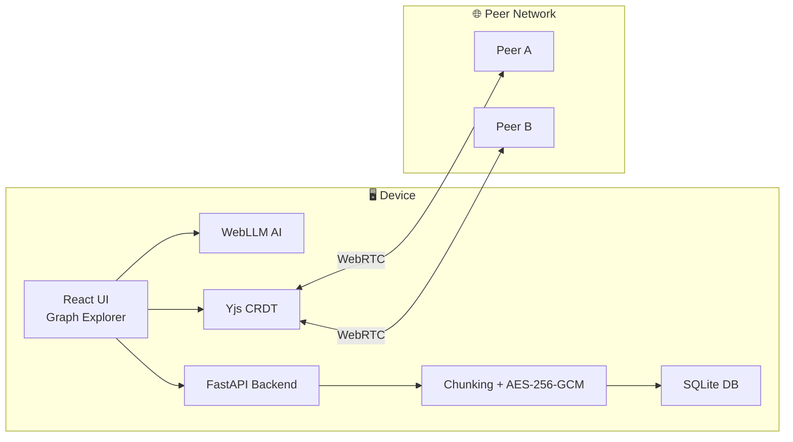
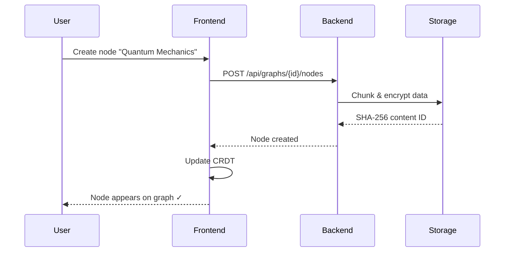
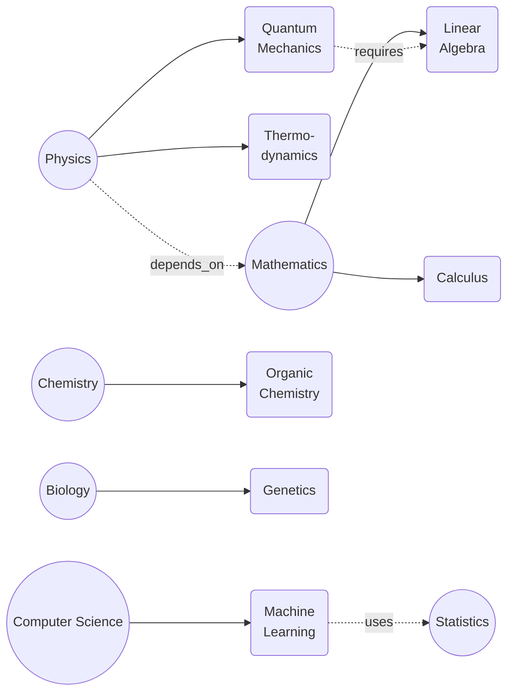

<div align="center" style="background:#0a0e14;padding:20px;border-radius:16px">


# 🌐 Project Mycelium

**A local-first, peer-to-peer knowledge graph with offline AI, CRDT sync, and encrypted storage — zero cloud dependency.**

<p>


</p>

</div>

---

## ✦ Overview

Project Mycelium is designed for **private, offline knowledge management** with:

* **Local-first storage** – SQLite + content-addressed SHA-256 + AES-256-GCM
* **Peer-to-peer collaboration** – WebRTC mesh network, conflict-free edits
* **Offline AI explanations** – WebLLM on-device intelligence
* **Interactive graph** – D3.js visualization of nodes and connections

> Like fungal mycelium, ideas propagate underground — resilient, private, and interconnected.

---

## ✦ Features

<details>
<summary>Click to expand features</summary>

* **Local-first & encrypted storage** – Keep data on your device with AES-256-GCM.
* **CRDT sync** – Yjs ensures safe, conflict-free peer collaboration.
* **On-device AI** – WebLLM explains concepts without internet or cloud.
* **Interactive visualizations** – D3.js graphs for exploring knowledge networks.
* **Static offline demo** – Open `demo/mycelium_demo.html` anywhere.

</details>

---

## ✦ Quick Start

### Clone & Run

```bash
git clone https://github.com/Zorvia/project-mycelium.git
cd project-mycelium
npm run dev
```

* Frontend → [http://localhost:3000](http://localhost:3000)
* Backend  → [http://localhost:8000](http://localhost:8000)
* API docs → [http://localhost:8000/docs](http://localhost:8000/docs)

### Offline Demo

```bash
python scripts/export_demo.py
# Open demo/mycelium_demo.html in any browser
```

### Docker

```bash
docker build -t mycelium:demo .
docker run -p 8000:8000 mycelium:demo
# Visit http://localhost:8000
```

---

## ✦ Architecture



<details>
<summary>Data Flow</summary>



</details>

---

## ✦ Demo Knowledge Graph



<details>
<summary>ASCII fallback (terminals)</summary>

```
Physics ──► Quantum Mechanics
Math    ──► Calculus
Physics depends_on Math
Quantum Mechanics requires Linear Algebra
```

</details>

---

## ✦ Project Structure

```bash
project-mycelium/
├── src/
│   ├── backend/
│   └── frontend/
├── scripts/
├── demo/
├── docs/
├── tests/
├── Dockerfile
├── docker-compose.yml
├── package.json
├── requirements.txt
└── LICENSE.md
```

---

## ✦ Philosophy

* **Your data is yours** – no cloud, no accounts, fully encrypted
* **Knowledge should be free** – open-source, educational, and collaborative
* **Privacy by default** – encryption is standard

---

## ✦ Contributing

* Clear, maintainable code
* Respect project architecture & style
* All contributions welcome

Repository: [GitHub](https://github.com/Zorvia/project-mycelium)

---

## ✦ License

[Zorvia Public License v2.0](LICENSE.md)

```text
Copyright (c) 2026 Zorvia Community

Permission granted to use, copy, modify, and distribute under ZPL v2.0
```

---

<div align="center">

```text
        ◉───────◉───────◉
       ╱ ╲     ╱ ╲     ╱ ╲
      ◉   ◉───◉   ◉───◉   ◉
       ╲ ╱     ╲ ╱     ╲ ╱
        ◉───────◉───────◉
```

**Project Mycelium** — Nurturing Knowledge Without the Cloud
Built by the Zorvia Community

</div>

---

