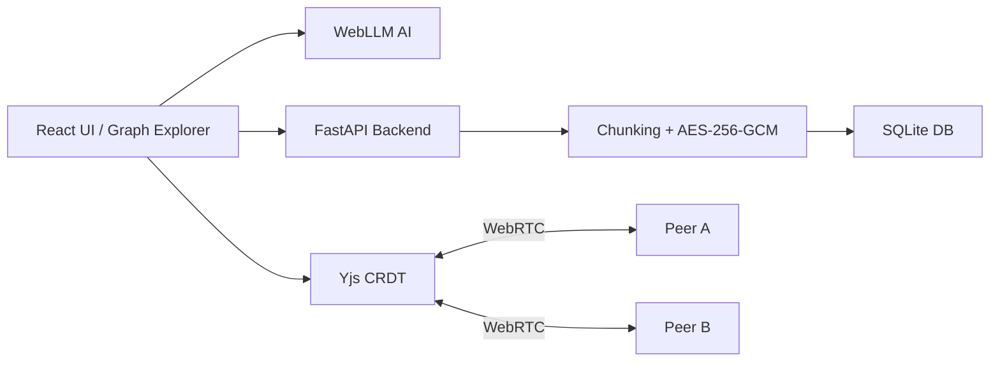

<div align="center">


# 🌐 Project Mycelium
**Local-first knowledge graph with offline AI, CRDT sync, and encrypted storage. Zero cloud dependency.**

> Like fungal mycelium, ideas propagate underground — resilient, private, and interconnected.

</div>

---

## ✦ Features

- **Local-first & encrypted storage** – AES-256-GCM, SQLite, content-addressed SHA-256
- **CRDT sync** – Yjs for conflict-free collaboration
- **Offline AI** – WebLLM explains concepts locally
- **Interactive visualizations** – D3.js graphs
- **Static offline demo** – Open `demo/mycelium_demo.html`

---

## ✦ Quick Start

```bash
git clone https://github.com/Zorvia/project-mycelium.git
cd project-mycelium
npm run dev
````

* Frontend → [http://localhost:3000](http://localhost:3000)
* Backend → [http://localhost:8000](http://localhost:8000)
* API docs → [http://localhost:8000/docs](http://localhost:8000/docs)

**Docker:**

```bash
docker build -t mycelium:demo .
docker run -p 8000:8000 mycelium:demo
```

---

## ✦ Architecture



---

## ✦ Project Structure

```
project-mycelium/
├── src/backend/
├── src/frontend/
├── scripts/
├── demo/
├── docs/
├── tests/
├── Dockerfile
├── docker-compose.yml
├── package.json
├── requirements.txt
└── LICENSE.md
```

---

## ✦ Philosophy

* Your data is yours — fully encrypted, no cloud
* Knowledge should be free — open-source and educational
* Privacy by default — encryption is standard

---

## ✦ Contributing

* Maintain clear, modular code
* Follow project style & architecture
* Open to all contributions

Repository: [GitHub](https://github.com/Zorvia/project-mycelium)

---

## ✦ License

[Zorvia Public License v2.0](LICENSE.md)


