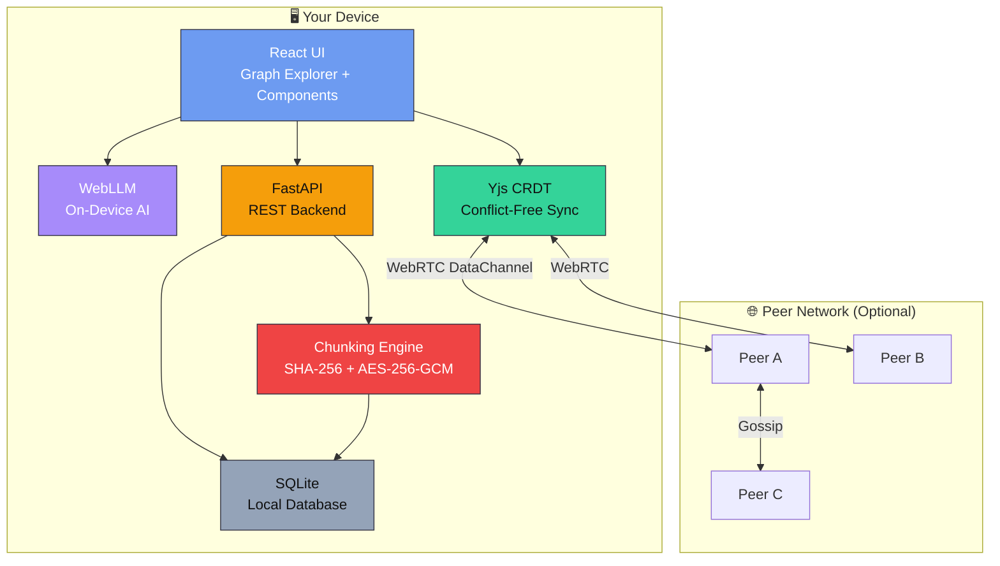
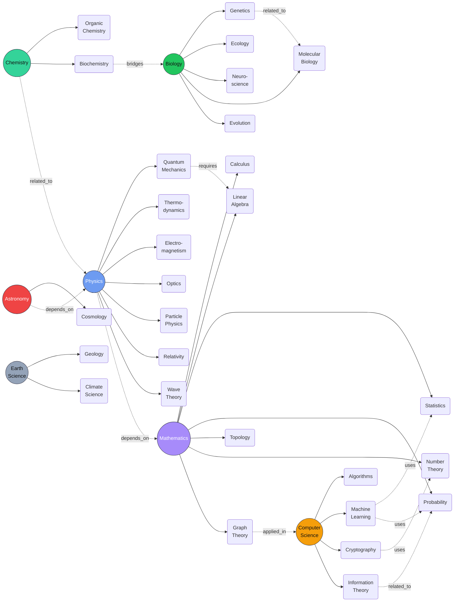

<div align="center">


<br />

# Project Mycelium

### *Nurturing Knowledge — Without the Cloud*

**A local-first, peer-to-peer knowledge graph with offline AI, CRDT sync, encrypted content-addressed storage — and zero cloud dependency.**

[](https://github.com/Zorvia/project-mycelium/actions/workflows/ci.yml)
[](LICENSE.md)
[](https://python.org)
[](https://nodejs.org)

</div>

---

> Like fungal networks connecting a forest underground, **Project Mycelium** links knowledge privately and resiliently — on your device, between peers, and without a central server.

---

## TL;DR — Run the demo in seconds

```bash
# Clone and run — one command
git clone https://github.com/Zorvia/project-mycelium.git
cd project-mycelium && npm run dev

# Frontend → http://localhost:3000
# Backend  → http://localhost:8000
# API docs → http://localhost:8000/docs
```

**No server? No problem.** Open `demo/mycelium_demo.html` in any browser — no install, no internet, no signup.

<details>
<summary><strong>Other quick options</strong></summary>

```bash
# Docker (backend + frontend)
docker build -t mycelium:demo .
docker run -p 8000:8000 mycelium:demo

# Export static demo
python scripts/export_demo.py  # → demo/mycelium_demo.html

# Seed demo DB
python scripts/seed_demo_data.py
```

</details>

---

## Why this exists

* **Privacy-first** — Your notes stay local (SQLite). No accounts, no cloud tracking.
* **Resilient collaboration** — Peer-to-peer sync (WebRTC + Yjs) with automatic CRDT merges.
* **Offline intelligence** — On-device WebLLM gives explanations without sending your data anywhere.
* **Secure by default** — Content-addressed storage (SHA-256) + AES-256-GCM for shared content.
* **Educational focus** — Map concepts, collaborate offline, and ask AI to explain ideas.

---

## Core Principles

|                Principle | What it means                                               |
| -----------------------: | ----------------------------------------------------------- |
|      🖥️ **Local-first** | Data lives on *your* device (SQLite). You own it.           |
|      🌐 **Peer-to-peer** | Collaborate directly over WebRTC — no server required.      |
|        🤖 **Offline AI** | WebLLM runs on-device for private concept explanations.     |
|         🔐 **Encrypted** | AES-256-GCM for shared data; authenticated, tamper-evident. |
|     ♻️ **Conflict-free** | Yjs CRDTs merge concurrent edits automatically.             |
| 🧩 **Content-addressed** | SHA-256 CIDs: content identity follows content.             |

---

## Architecture (at a glance)



---

## Demo Knowledge Graph



---

## Quick Start

```bash
# Clone
git clone https://github.com/Zorvia/project-mycelium.git
cd project-mycelium

# Frontend
cd src/frontend
npm ci
cd ../..

# Python
python -m venv .venv
source .venv/bin/activate
pip install -r requirements.txt

# Seed demo DB
python scripts/seed_demo_data.py

# Run
npm run dev
```

Open `http://localhost:3000` for frontend, `http://localhost:8000/docs` for backend API.

---

## License

**[Zorvia Public License v2.0](LICENSE.md)**

---

<div align="center">

```
        ◉───────◉───────◉
       ╱ ╲     ╱ ╲     ╱ ╲
      ◉   ◉───◉   ◉───◉   ◉
       ╲ ╱     ╲ ╱     ╲ ╱
        ◉───────◉───────◉
```

**Project Mycelium** — Nurturing Knowledge Without the Cloud

Built with care by the Zorvia Community · [Getting Started](#tl-dr) · [Documentation](#documentation) · [Contributing](CONTRIBUTING.md)

</div>
