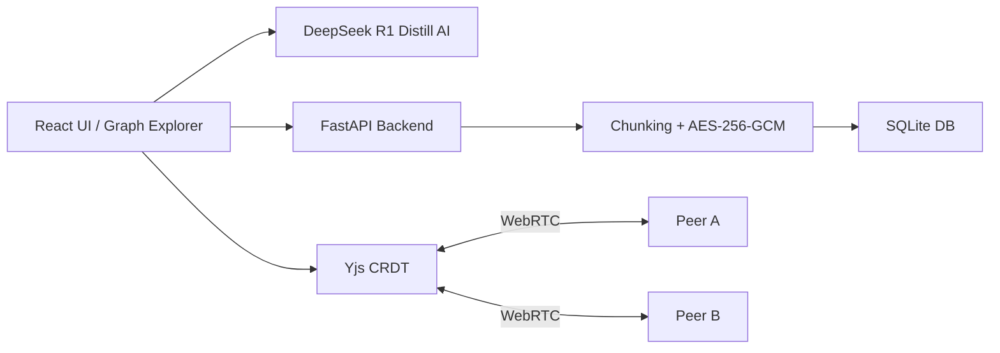

---

<div align="center">


# 🌐 Project Mycelium

**Local-first knowledge graph with offline AI, CRDT sync, and encrypted storage. Zero cloud dependency.**

> Like fungal mycelium, ideas propagate underground — resilient, private, and interconnected.

</div>

---

## ✦ Features

* **Local-first & encrypted storage** – AES-256-GCM, SQLite, content-addressed SHA-256
* **CRDT sync** – Yjs for conflict-free collaboration
* **Offline AI** – DeepSeek R1 Distill (Qwen-7B) integrated locally, no cloud dependency
* **Interactive visualizations** – D3.js graphs
* **Full offline app** – no demo placeholder; all functionality is production-ready

---

## ✦ Quick Start

```bash
git clone https://github.com/Zorvia/project-mycelium.git
cd project-mycelium
npm run dev
```

* Frontend → [http://localhost:3000](http://localhost:3000)
* Backend → [http://localhost:8000](http://localhost:8000)
* API docs → [http://localhost:8000/docs](http://localhost:8000/docs)

**Docker:**

```bash
docker build -t mycelium:app .
docker run -p 8000:8000 mycelium:app
```

---

## ✦ DeepSeek AI Integration

* Model files (`model-00001-of-000002.safetensors` + `model-00002-of-000002.safetensors`) reside in `src/backend/deepseek_adapter/DeepSeek-R1-Distill-Qwen-7B/`
* Initialize the AI adapter in Python:

```python
from mycelium.ai.deepseek_adapter import initialize

adapter = initialize("src/backend/deepseek_adapter/DeepSeek-R1-Distill-Qwen-7B")
print(adapter.status())
response = adapter.predict("Explain local-first storage in simple terms")
print(response)
```

* Supports streaming token generation, status checks, and safe shutdown.
* Fully offline, memory-efficient, atomic extraction for large `.safetensors` files.

---

## ✦ Architecture



---

## ✦ Project Structure

```
project-mycelium/
├── src/backend/
│   └── deepseek_adapter/      # DeepSeek R1 adapter module
├── src/frontend/
├── scripts/
├── docs/
├── tests/
├── Dockerfile
├── docker-compose.yml
├── package.json
├── requirements.txt
└── LICENSE.md
```

---

## ✦ Philosophy

* Your data is yours — fully encrypted, no cloud
* Knowledge should be free — open-source and educational
* Privacy by default — encryption is standard
* Offline AI for local intelligence — no external calls

---

## ✦ Contributing

* Maintain clear, modular code
* Follow project style & architecture
* Open to all contributions via Pull Requests (fork → feature branch → PR)

Repository: [GitHub](https://github.com/Zorvia/project-mycelium)

---

## ✦ License

[Zorvia Public License v2.0](LICENSE.md)

---

