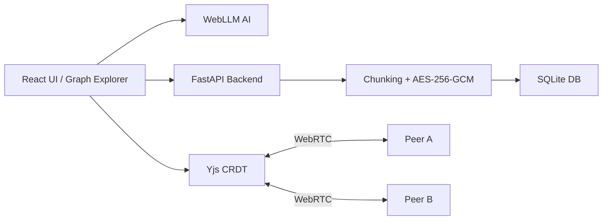

<div align="center">


# 🌐 Project Mycelium

**Local-first knowledge graph with offline AI, CRDT sync, and encrypted storage. Zero cloud dependency. Perfect for scientific exploration, research, and secure data collaboration.**

<p>
  <a href="https://github.com/Zorvia/project-mycelium/actions">
    
  </a>
  <a href="https://github.com/Zorvia/project-mycelium/blob/main/LICENSE.md">
    
  </a>
  <a href="https://stav.org.au/">
    
  </a>
</p>

> Like fungal mycelium, ideas propagate underground — resilient, private, and interconnected. Project Mycelium is designed for **scientific exploration, educational impact, and secure research collaboration**.

---

## ✦ Table of Contents

1. [Introduction](#-introduction)
2. [Scientific Motivation](#-scientific-motivation)
3. [Features](#-features)
4. [Quick Start](#-quick-start)
5. [Usage Examples](#-usage-examples)
6. [Architecture](#-architecture)
7. [Project Structure](#-project-structure)
8. [Technical Concepts Explained](#-technical-concepts-explained)
9. [Philosophy, Security & Ethics](#-philosophy-security--ethics)
10. [Contributing](#-contributing)
11. [License](#-license)
12. [Appendix / Resources](#-appendix--resources)

---

## ✦ Introduction

Project Mycelium is a **local-first knowledge graph platform** designed to simulate **resilient, decentralized networks** inspired by natural mycelium. It provides scientists, students, and hobbyists a tool to **store, visualize, and collaboratively explore knowledge**, all while **protecting data privacy** and supporting offline AI research.

* **Who it’s for:** Researchers, students, developers, educators
* **Purpose:** Enable collaboration and exploration of knowledge without cloud dependency
* **Key benefits:** Security, resilience, offline AI assistance, and rich interactive visualizations

---

## ✦ Scientific Motivation

The project draws inspiration from the **Science Talent Search (STS 2026)** goal of promoting **innovative STEM solutions**:

1. **Analogous Networks:** Fungal mycelium networks optimize for resilience and efficiency, offering a biological model for decentralized knowledge propagation.
2. **Offline AI for Research:** Ensures sensitive experimental data never leaves your machine while still providing intelligent analysis.
3. **CRDT Collaboration:** Peer-to-peer sync allows teams to **simultaneously contribute to a dataset**, avoiding conflicts and data loss.
4. **Data Privacy & Ethics:** Emphasizes ethical research practices and full ownership of experimental data.

---

## ✦ Features

| Feature                                | Scientific & Practical Relevance                                                                                                                           |
| -------------------------------------- | ---------------------------------------------------------------------------------------------------------------------------------------------------------- |
| **Local-first & Encrypted Storage**    | AES-256-GCM ensures that your experimental data, notes, and graphs are secure. SHA-256 content addressing prevents data duplication and ensures integrity. |
| **CRDT Sync (Yjs)**                    | Conflict-free collaborative editing enables multiple researchers to simultaneously explore a knowledge graph without overwriting each other’s work.        |
| **Offline AI (WebLLM)**                | Generates explanations, summaries, and predictions locally to assist hypothesis generation without exposing sensitive data.                                |
| **Interactive Visualizations (D3.js)** | Allows researchers to **observe connections and patterns** visually within their datasets.                                                                 |
| **Static Offline Demo**                | Test the system instantly without installation using `demo/mycelium_demo.html`.                                                                            |
| **Docker Support**                     | Ensures reproducibility of experiments in different computing environments.                                                                                |

---

## ✦ Quick Start

### 1. Clone the Repository

```bash
git clone https://github.com/Zorvia/project-mycelium.git
cd project-mycelium
```

### 2. Install Dependencies

```bash
npm install        # Frontend
pip install -r requirements.txt  # Backend
```

### 3. Run Development Server

```bash
npm run dev
```

* **Frontend:** [http://localhost:3000](http://localhost:3000)
* **Backend:** [http://localhost:8000](http://localhost:8000)
* **API Docs:** [http://localhost:8000/docs](http://localhost:8000/docs)

### 4. Docker Setup

```bash
docker build -t mycelium:demo .
docker run -p 8000:8000 mycelium:demo
```

* Ensures **reproducibility for experiments** across platforms.

---

## ✦ Usage Examples

### Adding Knowledge Nodes

```javascript
graph.addNode({ id: 'experiment1', label: 'Water Quality Study' });
graph.addNode({ id: 'experiment2', label: 'Algal Bloom Analysis' });
graph.addEdge('experiment1', 'experiment2');
```

### Querying Offline AI

```javascript
ai.ask('Explain the impact of nutrient runoff on algal bloom formation.');
```

**AI Response:** Provides a **scientific explanation and references** locally without internet access.

### Collaborative Experiments

* Open multiple devices or computers
* Edit the same knowledge graph
* CRDT ensures **automatic conflict resolution**

---

## ✦ Architecture



* **Frontend:** Handles graph exploration, editing, and AI interaction
* **Backend:** Processes requests, encrypts and chunks data, stores it locally
* **CRDT Layer:** Ensures **multi-peer collaboration without conflicts**
* **AI Layer:** Localized intelligence to assist research and hypothesis development
* **Peer-to-Peer Network:** Direct synchronization using WebRTC

---

## ✦ Project Structure

```
project-mycelium/
├── src/backend/          # FastAPI backend source code
├── src/frontend/         # React frontend source code
├── scripts/              # Utilities and maintenance scripts
├── demo/                 # Offline demo HTML for testing
├── docs/                 # Extended documentation, guides, and tutorials
├── tests/                # Unit and integration tests
├── Dockerfile            # Docker build instructions
├── docker-compose.yml    # Multi-service development setup
├── package.json          # Node.js dependencies and scripts
├── requirements.txt      # Python dependencies
└── LICENSE.md            # Project license
```

---

## ✦ Technical Concepts Explained

### AES-256-GCM Encryption

* Symmetric encryption standard
* Protects confidentiality, integrity, and authenticity of experimental data

### SHA-256 Content Addressing

* Each chunk of data is hashed
* Prevents duplication and ensures tamper-proof storage

### CRDTs (Conflict-Free Replicated Data Types)

* Supports simultaneous edits by multiple users
* Automatically merges conflicts, ideal for **collaborative experiments**

### Chunking

* Breaks large datasets into small, manageable encrypted units
* Improves storage efficiency and synchronization speed

### Offline AI (WebLLM)

* Runs entirely on your device
* Generates summaries, explanations, or predictions
* No cloud dependency ensures **privacy of sensitive research data**

---

## ✦ Philosophy, Security & Ethics

1. **Ownership of Data:** Researchers retain full control of their data.
2. **Privacy by Default:** All information is encrypted and offline.
3. **Open Science & Education:** Encourages **sharing knowledge responsibly**.
4. **Resilient Collaboration:** Peer-to-peer CRDT networks ensure your work is **never lost**.
5. **Ethical Research Practices:** Designed for safe, responsible handling of experimental data.

---

## ✦ Contributing

We welcome contributions from students, researchers, and developers:

* **Code Style:** Modular, well-documented, and maintainable
* **Testing:** Unit tests required for new features
* **Pull Requests:** Small, descriptive, with clear rationale
* **Community Conduct:** Respectful and educational collaboration

Repository: [GitHub](https://github.com/Zorvia/project-mycelium)

---

## ✦ License

[Zorvia Public License v2.0](LICENSE.md) – Open-source, free to use, modify, and redistribute for research, educational, or personal purposes.

---

## ✦ Appendix / Resources

* **D3.js:** [https://d3js.org](https://d3js.org) – Interactive graph visualization library
* **Yjs CRDT:** [https://yjs.dev](https://yjs.dev) – Conflict-free collaborative editing framework
* **FastAPI:** [https://fastapi.tiangolo.com](https://fastapi.tiangolo.com) – Backend API framework
* **WebLLM:** [https://github.com/your-org/web-llm](https://github.com/your-org/web-llm) – Local offline AI
* **SQLite:** [https://sqlite.org](https://sqlite.org) – Lightweight, reliable database


